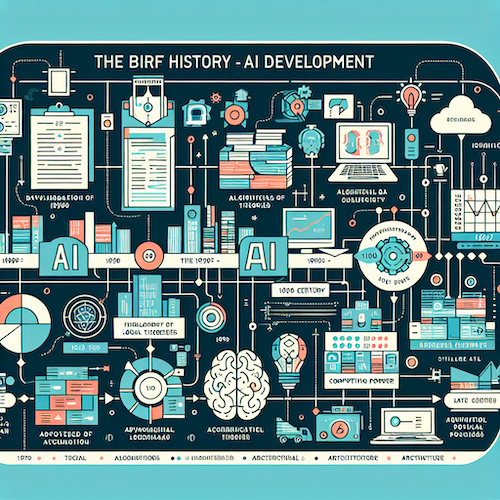
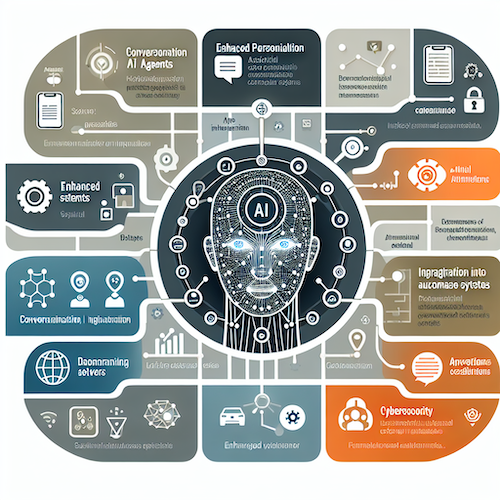
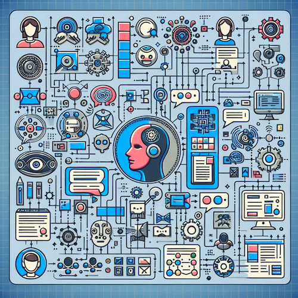
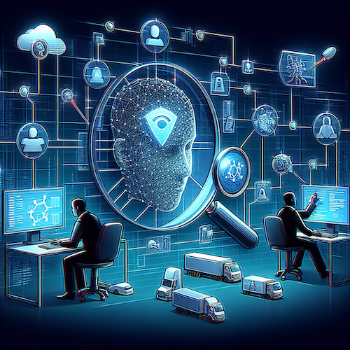
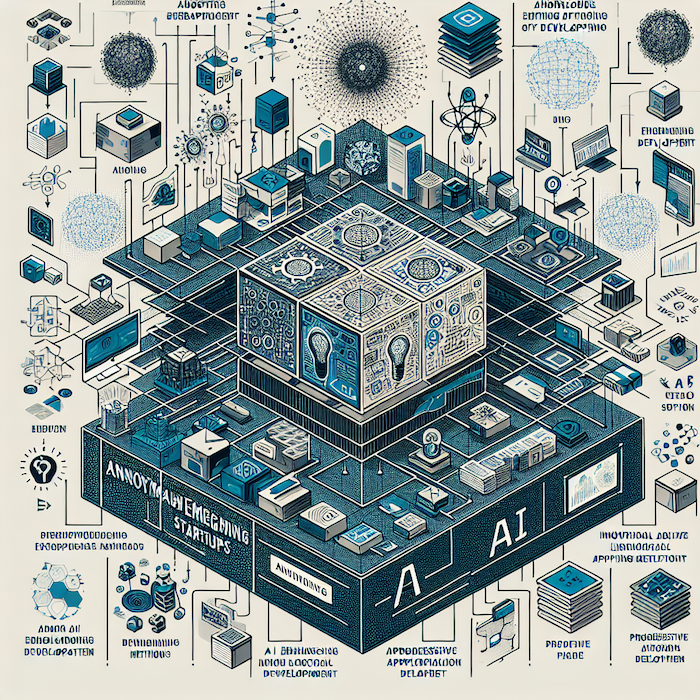
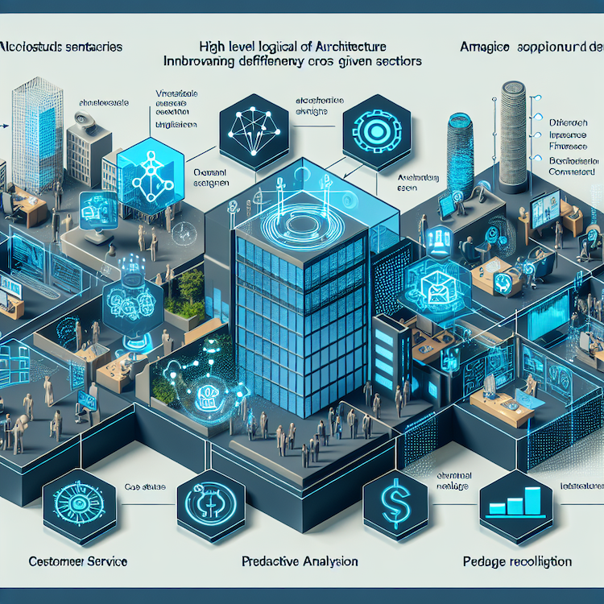
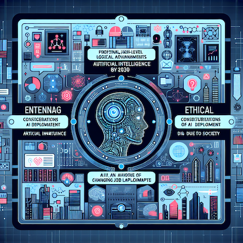

# The Future of AI Agents: Trends, Key Players, and Innovations You Need to Know

## I. Introduction to AI Agents

Artificial Intelligence (AI) agents have become an integral part of various industries, redefining automation and data interaction. With the capability to make decisions, learn from data, and engage with users in real-time, AI agents represent the next frontier of technology. This article aims to explore the latest trends in AI agents, the key players in the space, and the potential future developments we can expect.

By understanding the evolving landscape of AI agents, businesses and consumers alike can make informed decisions on adopting, adapting, or investing in this transformative technology. The accelerated pace of AI adoption has been fueled by advancements in machine learning, natural language processing, and the increasing availability of big data. As we delve into the expansive world of AI agents, it is essential to discern their definitions and historical context.

### Definition of AI Agents

In essence, AI agents are computational entities that utilize AI techniques to autonomously perform tasks and make decisions based on the data they receive. These agents can be rule-based or learn from their interactions with users or other systems, often employing techniques such as reinforcement learning or deep learning to improve their performance over time. AI agents can take various forms, including chatbots, virtual assistants, and autonomous vehicles, each tailored to serve specific functions and industries.

### Brief History of AI Development

The inception of AI dates back to the 1950s, characterized by logical theories and symbolic manipulation. However, the true potential of AI agents began to materialize in the late 20th century when advancements in algorithms, computing power, and data accessibility coincided. The development of machine learning propelled the field into a new era, enabling systems to learn from past experiences rather than merely following preset rules.

The advent of the internet and mobile technology in the 1990s and 2000s facilitated the collection of vast amounts of data, further enhancing AI agents' capabilities. Companies like IBM and Google spearheaded research and development efforts, leading to the emergence of intelligent systems that we see today. Today, AI agents are not merely tools but are evolving into collaborative entities that significantly enhance productivity, efficiency, and customer experiences across sectors.

## II. Latest Trends in AI Agents

As AI technology continues to evolve, several noteworthy trends are shaping the landscape of AI agents. Understanding these trends helps businesses identify opportunities for innovation and improved operational processes.

### 1. Emergence of Conversational AI

Conversational AI has made significant strides over recent years, revolutionizing how businesses interact with customers. Chatbots and virtual assistants like Google Assistant and Amazon Alexa are leading the charge, enabling users to engage with technology seamlessly. These AI agents leverage natural language processing (NLP) to understand and respond to human queries in real-time.

The role of conversational AI extends beyond simple queries; they now handle complex transactions, escalate issues when needed, and maintain contextual conversations, making customer interactions more engaging. As this technology evolves, organizations can expect enhanced user experiences and increased operational efficiency.

### 2. Enhanced Personalization

Personalization is becoming an integral feature within AI agents, particularly in e-commerce and entertainment sectors. AI agents utilize algorithms that analyze user preferences and behavior to deliver tailored recommendations. Take, for example, Netflix's recommendation system, which employs AI to suggest content based on user viewing habits.

This level of personalization not only elevates customer satisfaction but also drives revenue. By delivering what customers want before they ask, businesses can foster loyalty and increase sales. As the demand for personalized experiences grows, companies will continue to invest in developing more sophisticated AI agents capable of learning and adapting to user preferences dynamically.

### 3. AI Agents in Autonomous Systems

The integration of AI agents into autonomous systems such as drones and self-driving cars exemplifies one of the boldest frontiers of this technology. Companies like Tesla are at the forefront, deploying AI to enhance safety, navigation, and performance through systems like Tesla's Autopilot.

These AI agents exhibit remarkable decision-making capabilities, processing vast amounts of data from sensors and environmental inputs to navigate complex scenarios. The implications for various industries, including logistics, agriculture, and transportation, are profound, presenting opportunities for increased safety and efficiency while concurrently reducing human error.

### 4. AI in Cybersecurity

As the digital landscape evolves, so do the threats it faces, ushering in advanced AI agents aimed at bolstering cybersecurity. With the increasing frequency and sophistication of cyberattacks, conventional security measures often fall short. Enter Darktrace AI, a company that employs machine learning to detect and respond to threats in real time.

AI agents in cybersecurity analyze network traffic and user behavior to identify anomalies and potential risks. By automating threat detection and response, businesses can minimize the damage of attacks significantly. The future of cybersecurity hinges on AI agents, empowering organizations to proactively protect sensitive data and assets.

## III. Key Players in the AI Agent Market

The AI agent market is characterized by competition between established technology giants, innovative startups, and academic institutions contributing to the research and development of AI technologies.

### 1. Giants in the Industry

Prominent players like Google, Amazon, Microsoft, and IBM are at the forefront of AI agent development. Google, with its extensive suite of cloud-based services and machine learning platforms, continually enhances its virtual assistant capabilities. Amazon's Alexa not only serves as a household assistant but also integrates into various smart devices and services, creating a cohesive ecosystem around it.

Microsoft's focus on AI through Azure, combined with its productivity tools, allows organizations to leverage AI agents to streamline tasks and improve collaboration. IBM, with its Watson platform, emphasizes business intelligence and decision-making processes, showcasing how AI can transform organizations' operations.

### 2. Emerging Startups

In contrast to these established players, numerous startups are making waves with innovative AI agent solutions. OpenAI, for example, focuses on developing advanced language models that push the boundaries of conversational AI. UiPath, on the other hand, specializes in Robotic Process Automation (RPA), enhancing business efficiency through intelligent automation.

These startups challenge conventional norms and invigorate competition, pushing larger companies to innovate actively. Their nimbleness enables them to adapt quickly to consumer needs, driving the landscape of AI agents forward.

### 3. Academic Contributions

The role of academic institutions in advancing AI cannot be overstated. Research from renowned universities contributes significantly to breakthroughs in machine learning and AI techniques. Collaborative efforts between academia and industry often yield prosperous results, leading to practical applications in real-world scenarios.

Key universities are involved in AI research, fostering innovations and training the next generation of engineers and data scientists. Their contributions to algorithms, ethics in AI, and interdisciplinary studies support the growth of intelligent systems across sectors.

## IV. Noteworthy News and Developments

As the field of AI agents evolves, several recent developments mark significant milestones. Keeping abreast of notable partnerships, regulatory changes, and technological advances is crucial for decision-makers.

### Recent Significant Partnerships or Mergers

Partnerships between companies often lead to groundbreaking developments. A notable example is the collaboration between Microsoft and OpenAI, which aims to augment the capabilities of AI agents by integrating advanced language models into various Microsoft products. Such partnerships enable organizations to harness the capabilities of AI without building technologies from scratch.

### Advancements from AI Conferences and Workshops

Annual conferences such as NeurIPS and ICML are instrumental platforms where researchers, developers, and industry leaders congregate to share the latest findings and technologies. These conferences mark the unveiling of innovative AI models and techniques that push the frontiers of what AI agents can achieve.

Gleaning insights from these conferences can inform strategic directions and investment opportunities for businesses eager to leverage the latest advancements in AI.

### Regulatory Developments in AI Technology

As AI technology matures, so does the necessity for regulation to ensure ethical use and address privacy concerns. Governments and organizations are beginning to formulate frameworks governing AI's deployment, emphasizing transparency, accountability, and ethical considerations.

For instance, the European Union's proposed AI regulations seek to set a precedent for how AI agents should operate, particularly concerning data privacy and user protection. Stakeholders from the technology and legal sectors need to stay updated on these developments to mitigate compliance risks and align their strategies accordingly.

## V. Practical Applications of AI Agents

AI agents have found applications across various sectors, and their impact is vast and transformative. Examining case studies from multiple industries accentuates the value AI agents can deliver.

### Case Studies from Different Sectors

1. **Healthcare:** In telemedicine, AI agents streamline patient interaction systems by facilitating appointment scheduling, symptom checking, and basic consultations. Startups are leveraging AI to assist healthcare providers in diagnosing diseases based on patients’ historical data, leading to improved outcomes and operational efficiencies.
   
2. **Finance:** Within the financial sector, AI agents are employed for risk assessment, fraud detection, and customer service. AI platforms analyze transaction patterns to identify potential fraud and alert users in real time. Additionally, AI can provide personalized financial advice, significantly enhancing customer engagement.

3. **Customer Service:** Companies like Zendesk integrate AI agents into their customer service operations, allowing for rapid handling of inquiries, ticket creation, and even resolving common issues without human intervention. This not only improves response times but also reduces operational costs associated with customer support.

### Real-world Impact and Benefits

The successful implementation of AI agents translates into quantifiable benefits for organizations. Increased operational efficiency, reduced time and costs in service delivery, and enhanced customer experiences are some of the key advantages.

Take, for instance, a retail company that integrated AI agents into their customer support. They reported a 40% reduction in response times and a significant increase in customer satisfaction scores. Overall, the ongoing application of AI agents is proving to be beneficial in enhancing service delivery across various sectors.

## VI. Future Developments in AI Agents

As we gaze into the crystal ball, important predictions and considerations for the evolution of AI agents emerge.

### Predictions on AI Advancements by 2030

By the end of the decade, we can anticipate more sophisticated AI agents capable of understanding context and emotions. The evolution of affective computing will enable AI agents to adapt their interactions based on emotional cues from users, leading to more personalized and empathetic conversations.

### Ethical Considerations and Society's Evolving Relationship with AI

As AI agents become ubiquitous, the ethical implications surrounding their deployment will require attention. Ensuring that AI systems are free from bias and uphold user privacy will be a critical focus. Society must actively engage in dialogues about the ethical considerations of AI, fostering transparency and trust in these technologies.

### Future Job Impacts and New Opportunities

The rise of AI agents will inevitably reshape the job landscape. While concerns about job displacement abound, new opportunities will emerge, particularly in AI development, data analysis, and cybersecurity. As AI agents become increasingly advanced, the demand for skilled professionals who can work alongside these technologies will rise.

## VII. SEO Keywords and Resources

To ensure that this article reaches the intended audience effectively, incorporating relevant SEO keywords consistently will increase visibility and engagement. Suggested keywords for this article include:

- AI agents
- Conversational AI
- Personalized AI
- Autonomous systems
- AI in business
- Future of AI agents
- AI trends 2023

For further reading and exploration of the topic, consider checking academic journals on AI research and development, and industry reports from reputable sources like McKinsey, Gartner, and Forrester, which provide deep insights into the current state and future potential of AI technology.

## VIII. Conclusion and Call to Action

In conclusion, AI agents are poised to redefine industries worldwide, enabling businesses to enhance efficiency and customer engagement while addressing contemporary challenges. By encapsulating the latest trends, key players, and considering future developments, stakeholders can position themselves strategically within this evolving landscape.

To stay informed about AI advancements and their implications on society, we encourage readers to subscribe to relevant newsletters, join forums focused on AI discussions, and engage in ongoing learning. The future is not just about recognizing AI agents; it's about actively participating in shaping a world where these technologies can coexist and thrive alongside us.

By actively engaging with the insights presented in this article, you will be better prepared to navigate the fascinating yet complex world of AI agents as they continue to transform our lives and industries.